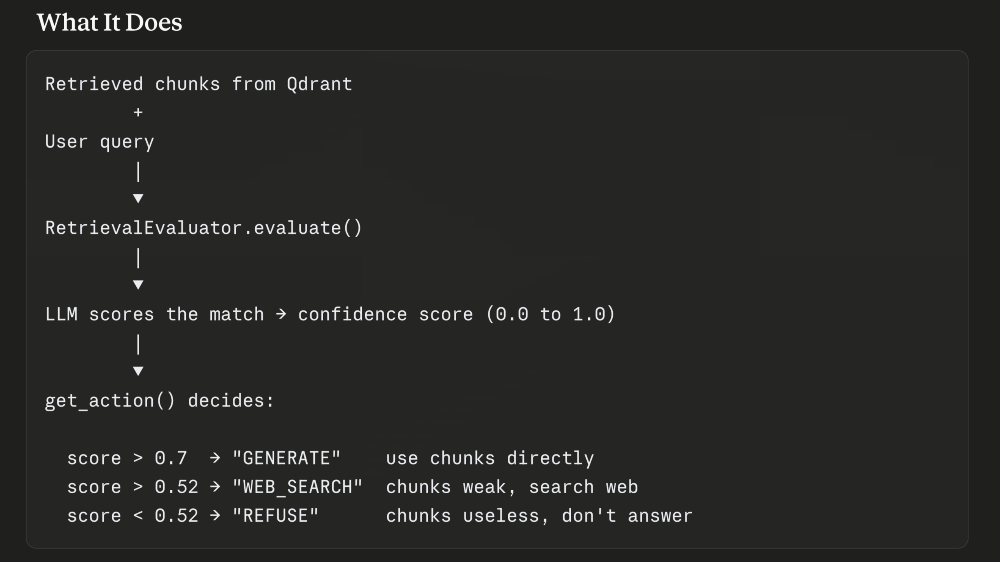

After Qdrant returns the top-5 chunks, the system has no way of knowing whether those chunks actually answer the user's question well. 

This file reads the query and retrieved chunks, asks the LLM "are these documents good enough?", gets back a confidence score, and decides what happens next.

How It Does ?
Sends a structured prompt to the LLM containing the query and document chunks. Instructs the LLM to respond in strict JSON with a "confidence_score" field. Parses that JSON and returns the float score. If JSON parsing fails, returns a safe fallback score of 0.5 rather than crashing.