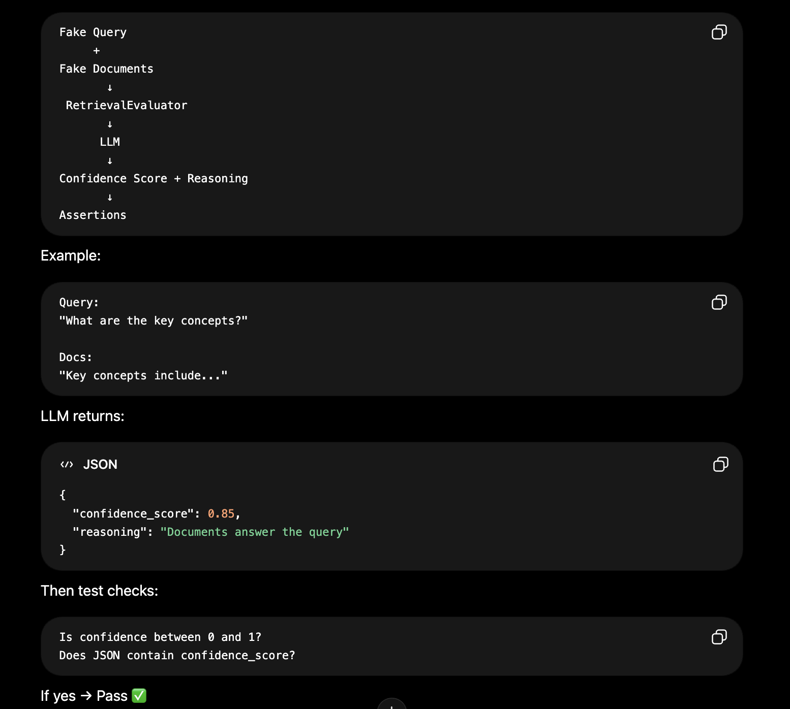
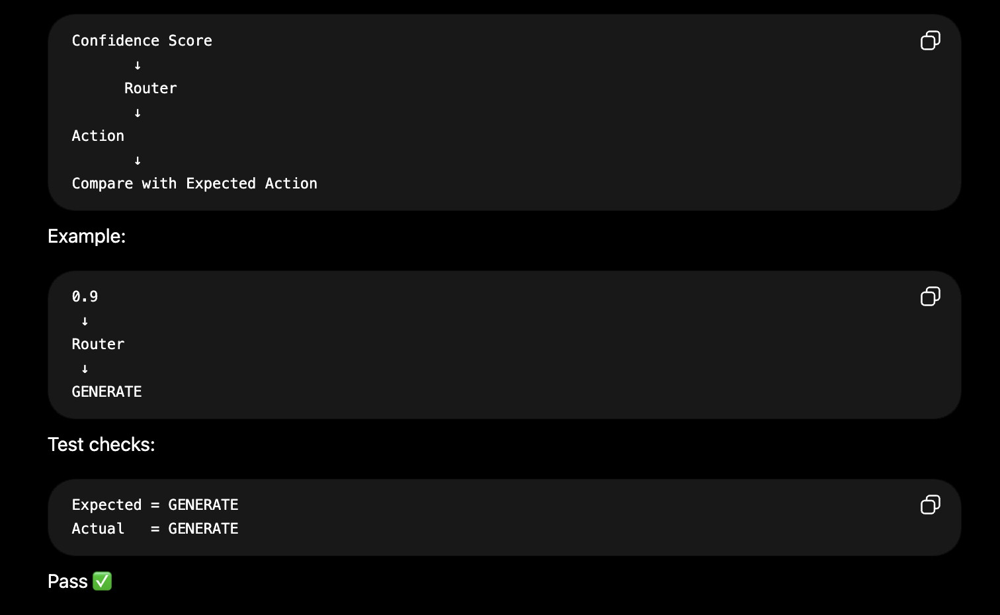
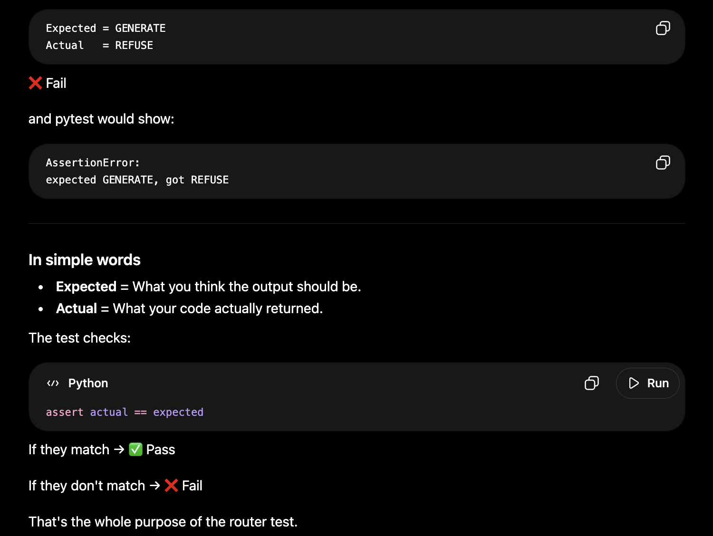

This file is quality check for Step 3 

It mainly checks two things : 
1. Evaluator -> Can it generate a valid confidence score?
2. Router -> Can it choose the correct action based on that confidence score?

We are not testing Qdrant , Embeddings or retrieval here. 

Flow of "test_evaluator_scoring()" -> 

Flow of "test_router_routing()" ->

